# Stereolabs ZED - Unity plugin

This package brings the many mixed reality features of the [ZED](https://www.stereolabs.com/zed/), [ZED Mini](https://www.stereolabs.com/zed-mini/) and [ZED 2](https://www.stereolabs.com/zed-2/) depth sensors into Unity. It comes with prefabs to make adding advanced features to your project as simple as drag-and-drop, helper scripts to simplify custom integration, and numerous examples to see the ZED/ZED Mini in action and learn how it works. 

Features include: 
 - Pass-through augmented reality with an Oculus Rift, HTC Vive and other headsets
 - Third person mixed reality
 - Real-time depth occlusion between the real and virtual
 - Adding virtual lights and shadows to real objects
 - Inside-out positional tracking
 - Spatial mapping
 - Real-time plane detection

## Getting Started

### Step 1: Check Compatibility

Make sure you have the following: 

**Hardware:** 
 - ZED, ZED-M or ZED2 camera *(ZED Mini preferred for AR pass-through)*
 - NVIDIA GPU with CUDA capability 3.0 or higher (a GTX 1060 or higher is recommended for AR pass-through)
 - Dual core processor clocked at 2.3GHz or higher
 - 4GB RAM or more
 - USB 3.0
 - Compatible VR headset *(required for pass-through AR)*

Supported VR headsets:
- Oculus Rift
- HTC Vive
- HTC Vive Pro*
- Windows Mixed Reality headset* (via SteamVR only)

**Stereolabs' ZED Mini mounting bracket was designed for the Oculus Rift and original HTC Vive. It can fit on some WMR headsets like the Samsung Odyssey, but you will need to create a custom attachment for the Vive Pro or other WMR headsets.*

**Software:** 
 - Windows 7-10, Ubuntu 16, Ubuntu 18
 - NVIDIA CUDA† ([download](https://developer.nvidia.com/cuda-downloads)) 
 - Unity 2017.3 or above ([download](https://unity3d.com/get-unity/download/archive)) 
 - ZED SDK ([download](https://www.stereolabs.com/developers/release/latest/))
 - ZED Unity plugin ([download](https://github.com/stereolabs/zed-unity/releases))

† *A Linux version of the plugin is available in the Linux_compatibility_beta branch for ZED SDK 2.8.
Since SDK 3.0, Windows and Linux version are in the same default branch.
See the tutorial (https://github.com/stereolabs/zed-unity/tree/master/ZEDCamera/Assets/ZED/Doc/Tutorials)*

### Step 2: Installation

 - Install the required version of **NVIDIA CUDA** and restart your computer. If you have existing versions of CUDA installed that aren't compatible with the current ZED SDK, uninstall them first.
 - Install the **ZED SDK** and restart your computer. 

### Step 3: Using the Universal Render Pipeline

To use the URP, you must either create a new Project that use URP, or upgrade an existing one.

#### Create a new URP Project

We recommend using [Unity Hub](https://docs.unity3d.com/Manual/GettingStartedUnityHub.html) to manage your projects and your versions of Unity.

 - Open Unity Hub and Click the **New** Button.
 - In the Template section, select the **Universal Project Template**.
 - Click **Create**. Unity automatically installs the URP package and sets up your project to use URP.

#### Upgrade to URP

 - Go to **Window** -> **Package Manager**. Find and install **Universal RP**.
 
Now you need to configure the URP. To do this, you have to create a Scriptable Render Pipeline Asset.
 - Right-click in the project window and select **Create** -> **Rendering** -> **Universal Render Pipeline** -> **Pipeline Asset**. 
You can also go to **Assets** -> **Create** -> **Rendering** -> **Universal Render Pipeline** -> **Pipeline Asset**.

Add this Render Pipeline Asset to your Graphics settings.
 - Go to **Edit** -> **Project Settings** -> **Graphics**. In the **Scriptable Render Pipeline Settings**, add the Universal Render Pipeline Asset you just created.
 
The last thing you need to do is upgrading your materials/shaders to URP.
  - Go to **Edit** -> **Render Pipeline** -> **Universal Render Pipeline** and select either **Upgrade Project Materials To URP Materials** or **Upgrade Selected Materials to URP Materials**.
These changes cannot be undone. Backup your Project before you upgrade it.

For more details on how to set up URP, see the [Universal Render Pipeline Documentation](https://docs.unity3d.com/Packages/com.unity.render-pipelines.universal@7.2/manual/index.html).

 ### Step 4: Import the Plugin

  - Go to **Assets** -> **Import Package** -> **Custom Package**. Navigate to where you downloaded the **ZED Unity Plugin** and import it.
  - Leave all files checked and click **Import**. (You can save space by unchecking the Examples folder on import, but we recommend the examples for first-time users.)
  - If you're prompted to upgrade your scripts, click **"I made a backup, go ahead!"** (We won't tell)
  - If you're prompted to change some settings, click **"Accept All"**.

## Example Scenes

After importing the plugin, pick and try some of the example scenes. Each is designed to demonstrate a main feature of the ZED. Some contain prefabs and example scripts that can be repurposed for your projects.

### Planetarium

A beautiful display of the ZED plugin's basic mixed reality features, viewable with or without a headset. Watch as the planets are properly occluded by the real world. Move your hand under the sun and see its warm glow light up your skin. Move, rotate and scale the planets with the keyboard, or with your VR controller if using the Oculus Integration or SteamVR plugins. 

### Movie Screen

Similar to the Planetarium sample, but now playing a 2D movie on a movable, scalable 3D screen. Demonstrates how 2D content can easily be displayed in a 3D, mixed reality scene. 

### Drone Battle

Defend yourself from attack drones that spawn around your room and shoot at you. Block lasers with your hand, and shoot back with the spacebar, or VR controllers if using the Oculus Integration or SteamVR plugin. The scripts show how to make use of **ZEDSupportFunctions.cs** to spawn objects in empty areas (**DroneSpawner.cs**) and shoot projectiles that can hit the real *or* virtual world (**Projectile.cs**). 

### Dark Room

Your office is now a night club! This scene darkens the real world, then casts a laser light show on your walls and floors, complete with tunes and a disco ball. Shows the usefulness of **ZEDManager**'s Camera Brightness feature, and creative ways to use **ZEDLight.cs**. 

### Simple Plane Detection

Run the scene and hold down spacebar to see if you're looking at a valid surface where a bunny could stand. Release the spacebar and a bunny will fall from the sky and land on that surface with proper physics. 

### VR Only Plane Detection (requires VR HMD and Oculus/SteamVR plugin)

Aim your controller at the floor and pull the trigger to place a bunny. Then, a baseball bat will appear in your hand. Smack the bunny and send it flying as far as it can go - you'll see the distance once it lands. Shows how plane detection can fit into a proper game, and how to use **ZEDSupportFunctions**'s HitTestOnRay to check for planes using world space. 

### ArUco Marker Detection (Requires OpenCV for Unity package)

Print out ArUco markers, put them in view of your ZED, and let the battle begin. Shows how to easily interface the ZED with OpenCV for marker detection using a variety of included scripts. Must have the [OpenCV for Unity](https://assetstore.unity.com/packages/tools/integration/opencv-for-unity-21088) package (trial or full version) imported to use. 

### Greenscreen 

Aim your ZED at a greenscreen and hit Play to see your subject standing in a small town in the desert. You'll see that the nearby crates still have all the proper occlusion, but the greenscreen background is replaced with the virtual background. Attach the ZED to a controller or Vive Tracker and specify it in **ZEDControllerTracker** to move the ZED around in your tracked VR space. 

### Mixed Reality Calibration

Use our interactive, in-VR app to calibrate your ZED with a tracked object, like a controller or Vive Tracker, to make capturing mixed reality videos easier than ever. 

## Creating Your First Project

 - Make a new scene and delete the main camera. 
 - In the Project tab, go to **Assets** -> **ZED** -> **Prefabs**. 
 - If you plan on doing pass-through AR, drag and drop **ZED_Rig_Stereo** into the scene. Otherwise, use **ZED_Rig_Mono** instead to save performance. 

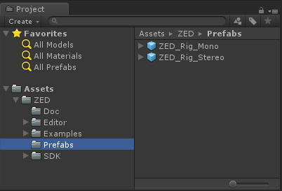

 - Right-click the Hierarchy and click **3D Object** -> **Sphere** to put a basic sphere into the scene. Position it about a meter in front of the ZED camera rig. 
 - Select the **Directional Light** in your scene. Add a **ZED Light** component. 
 - Set the **Directional Light** to point straight down by setting its X Rotation to 90 in its **Transform** component. 
 - Run the scene. You'll see the sphere floating in the real world, and casting a shadown below it. 

## Adding AR Passthrough

This assume you have a VR headset (Oculus Rift, HTC Vive, HTC Vive Pro or Windows Mixed Reality headset) with a ZED Mini mounted on front. 

 - If you used **ZED_Rig_Mono** in the last scene, replace it with **ZED_Rig_Stereo**. 
 - Go to **Edit** -> **Project Settings** -> **Player**. 
 - Enable **Virtual Reality Supported**. In Unity 2017.1 or 2017.2, this is in the **Other Settings** section. In 2017.3 and above, it's in **XR Settings**.
 - Run the scene and put on the headset. 

#### If using a WMR Headset:
The ZED Unity plugin supports WMR headsets via SteamVR only, which requires different settings than described in Unity's [WMR Quick Start Guide](https://docs.unity3d.com/Manual/wmr_quick_start.html). If you have trouble getting it to run, make sure that: 

* Your platform (in Build settings) is set to PC, Mac & Linux Standalone (Not Universal Windows Platform)
* OpenVR is listed in your Virtual Reality SDKs list, ideally at the top of the list
* [Windows Mixed Reality for SteamVR](https://store.steampowered.com/app/719950/Windows_Mixed_Reality_for_SteamVR/) is installed on your PC

## Understanding ZED_Rig_Mono and ZED_Rig_Stereo

The ZED Rig prefabs replace the regular Camera in a Unity scene, and handle everything the user sees, both real and virtual. It captures the virtual world while also projecting the real world in 3D so that the final output will be a combination of the two with proper occlusion and shadows. When using the ZED or ZED Mini in a scene, you will almost always want one of these two prefabs in it. 

The two rigs differ slightly in hierarchy but have three main parts: 

 - **Root object**: Holds the *ZEDManager* component, allowing you to change numerous camera settings (listed in the next section) via the Inspector. When not in AR pass-through mode, this object is the one that moves when Tracking is enabled. 
 - **Camera object(s)**: Holds a Unity Camera, and the *ZEDRenderingPlane* component, which handles how the Camera renders. It also sets up the Frame object with the proper transform, materials and material settings. In AR pass-through mode, this is what moves around. 
 - **Frame object(s)**: Quad(s) positioned in front of the camera, textured with video from the real-life ZED. Rendered with a material that offsets the depth of each pixel based on its depth as calculated by the ZED SDK, allowing real-time occlusion and lighting effects. 

Which prefab to use depends on whether you are doing AR pass-through. If so, choose **ZED_Rig_Stereo.** If not, choose **ZED_Rig_Mono.** (ZED_Rig_Stereo will work as well but its second, unused Unity camera will cost performance.) Always delete the default Unity camera in a scene before dropping in one of the ZED rig prefabs. 

### ZED_Rig_Mono

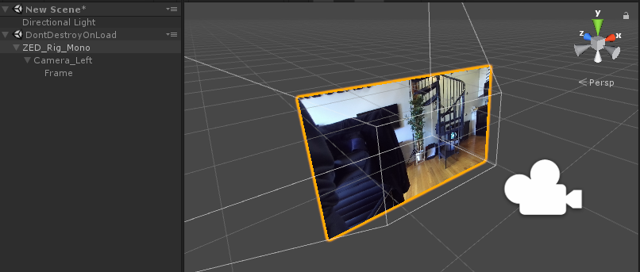

The mono rig is perfect for third-person mixed reality, or any kind of augmented reality where a headset isn't used. It has a single Unity camera that outputs the final video stream to the main display like any other. The "real" part of the video feed comes from the ZED's left camera. 

### ZED_Rig_Stereo

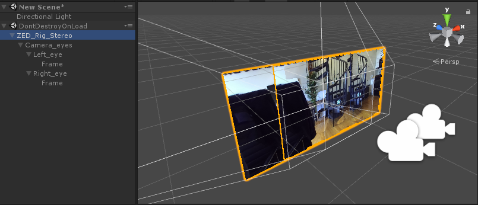

The stereo rig is necessary for AR pass-through, but will have the same behavior as the mono rig if no headset is being used. It has two Unity cameras and two Frame objects - one for each eye. The two cameras are a child object of an empty "Camera_eyes" object, that represents the center of the user's head. 

With VR enabled in the Player settings, you can just drag the camera into the scene and run it. When a headset is detected, the prefab will position Camera_eyes using Unity's built-in VR/XR functions. As such, you do not need any other plugins to use pass-through AR unless you want to add controller support. 

## Key Scripts

### ZEDManager.cs

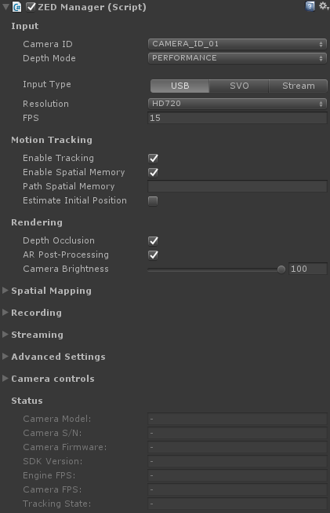

**ZEDManager** is the central script of the plugin, and the primary way a user like yourself interacts with the ZED within Unity. It sets up and closes the connection to the ZED, adjusts parameters based on user settings, enables/disables/handles features like tracking, and holds numerous properties, methods and callbacks a developer can find useful. ZEDManager is attached to the root object of both ZED rig prefabs. 

**Input:**

 - Camera ID: You can connect up to four ZED or ZED Mini cameras to a single PC at once. This value decides which camera you'll connect to. Note that the order of cameras is defined by the order in which Windows recognizes the devices. 
 - Depth Mode: The accuracy of depth calculations. Higher settings mean more accurate occlusion and lighting but costs performance. Note there's a significant jump in performance cost between QUALITY and ULTRA modes. 
 - Input Type: The ZED SDK can take input from one of three methods: 
    - USB: Input from a live camera attached to your ZED. You can specify the resolution and FPS of that camera. 720p and 60FPS is the best balance for AR pass-through.
    - SVO: Load a recorded SVO file taken during a previous session with a live ZED. This file acts as if a live ZED were attached. Specify the path to the .SVO file, whether to loop it once finished, and whether to play each frame based on its time stamps or sequentially. 
    - Stream: Input from a ZED on a remote device that's actively streaming its camera input. Set the IP and Port to connect to. See the Streaming section of ZEDManager to broadcast a stream.

**Motion Tracking:**
 - Enable Tracking: When enabled, the ZED will move/rotate itself using its own inside-out tracking, regardless of whether an HMD is attached. In AR pass-through mode, it will combine its tracking with the HMDs and allow our timewarp feature for latency compensation. 
 - Enable Spatial Memory: When this and Tracking are enabled, the ZED will remember points in the scene to relocalize itself when there is tracking drift. Tracking is more accurate but may "jump" when it relocalizes. 
 - Path Spatial Memory: If using Spatial Memory, you can specify a path to an existing .area file to start with some memory already loaded. .area files are created when using Spatial Mapping (see ZEDSpatialMapping.cs). 

**Rendering:**
 - Depth Occlusion: When enabled, virtual pixels can be covered up by real pixels, allowing a virtual cube to be behind your real table, for example. Turn off to make virtual objects always appear over the real world. 
 - AR Post-Processing: Whether to apply additional post-processing effects to make the pass-through experience feel more realistic. Requires extra performance but is usually worth it. 
 - Camera Brightness: Lower to make the real world darker. Note that this doesn't change the actual input from the camera, but the final material, meaning that re-lighting the real world will make it brighter realistically (see the Dark Room sample). 

**Spatial Mapping**

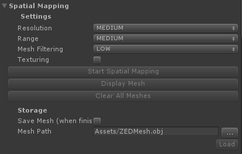

*Note: In plugin version 2.7.1 and earlier, the Spatial Mapping interface was in a standalone class called ZEDSpatialMappingManager.*

Lets you scan your environment into a mesh. Useful for collisions where geometry must be persistent, for building navmeshes that AI can use to navigate, and for saving the meshes for later. It is also how you create a .area file used by the Spatial Memory feature of **ZEDManager**. 

During runtime, click **Start Spatial Mapping** to start the scan. Once you've scanned enough, hit "Stop Spatial Mapping" to finish the mesh (and save it if needed). 

 - **Resolution** governs the detail of the mesh. Medium is recommended not only for performance, but because it tends to average out minor depth errors. 
 - **Range** governs how far a surface can be and still get scanned. Medium is recommended not only for performance, but to ensure accuracy. 
 - **Mesh Filtering** governs how much the mesh is smoothed when finished. Low is usually best, but increasing it can sometimes help with some tough-to-scan surfaces. 
 - **Texturing** saves the surface texture in addition to the geometry. Note that this will add significantly to the time it takes to finalize the mesh. 
 - **Save Mesh** causes the mesh to get saved as an .obj, .bin, or .ply file to the finalized path. It also saves the .area file used for spatial memory if both Enable Tracking and Spatial Memory is enabled on the ZEDManager.

Read more [here](https://docs.stereolabs.com/mixed-reality/unity/spatial-mapping-unity/), or try the included Spatial Mapping sample scene. 

**Recording:**

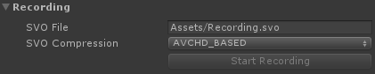

At runtime, you can record an .SVO video file of the ZED's input, to be played back later and used as if it were input from a live ZED. 

- SVO File: Where the recorded file will be saved. Specify a filename that ends in .svo. 
- SVO Compression: Which method of compression to be used. AVCHD_BASED achieves small file size and is generally recommended. 
- Start/Stop Recording: Press this at runtime to start recording to the specified file. 

**Note: In plugins v2.7.1 and prior, this function was handled by the now-deprecated ZEDSVOManager component.**

**Streaming:**

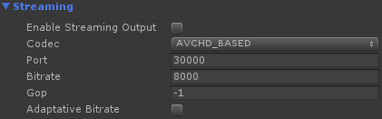

You can broadcast your ZED's video so that other devices can use it as input. 

* **Enable Streaming Output**: Check this to enable streaming. It will automatically start when you run the app. 
* **Codec**: The compression used to encode the output video. 
* **Port**: The port on which to broadcast the stream.
* **Bitrate**: How much information to send at once.  Lower settings results in lower video quality but is easier on the network. 
* **GOP**: Maximum GOP size for the codec. Setting this to -1 removes the limit.
* **Adaptative Bitrate**: Enable to automatically increase and decrease the bitrate based on performance. 

**Advanced Settings:**

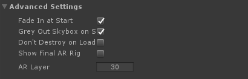

 - Fade In At Start: Disable to remove the fade-in effect you see when the ZED is first connected. 
 - Grey Out Skybox on Start: Removes color and color emissions from the skybox, which can cause unrealistic lighting effects in an AR scene. Leave this checked when the real environment is more prominent than the virtual environment, such as pass-through AR. Turn it off when virtual elements are predominant, such as greenscreen VR capture. 
 - Don't Destroy On Load: Enable to set the ZED rig's [DontDestroyOnLoad](https://docs.unity3d.com/ScriptReference/Object.DontDestroyOnLoad.html) value, which will prevent its destruction when you change scenes. 
 - Show Final AR Rig: In pass-through AR mode, the plugin uses a second, hidden AR rig to make final adjustments to the image before it's sent to the headset. It's hidden by default because it can be quite confusing to see, but this setting lets advanced users observe and modify this rig. See **ZEDMixedRealityPlugin** below for more details. 
 - AR Layer: The second AR rig needs to see nothing but the canvases in front of it. To accomplish this while making it simple to understand for users, we assign the quad objects in the AR rig to the layer specified here, and it's the only layer that the cameras in that rig can see. Assign this to an unused layer, and make sure not to put other objects in it. 

Useful public members of **ZEDManager.cs** include:

 - `public event OnZEDManagerReady OnZEDReady`: A callback that fires after the ZED is finished initializing. Useful for having a script wait until the user can see the world before doing something. 
 - `public static ZEDManager GetInstance(sl.ZED_CAMERA_ID)`: Returns the ZEDManager instance in the scene that's connected to the specified camera ID (1 - 4).
 - `public static List<ZEDManager> GetInstances()`: Returns all active ZEDManager instances in the scene.
 - `public Transform GetLeftCamera()`: Returns the the left camera component in the rig. There is also a right-camera counterpart, but it's best to use this method as both ZED rig prefabs (ZED_Rig_Mono and ZED_Rig_Stereo) use the left camera. 

### ZEDRenderingPlane.cs

**ZEDRenderingPlane** configures and updates the Frame objects in the camera rig that display the real world, and is responsible for actually mixing the real and virtual images. You usually don't need to interact with it, but as it's central to the plugin's functionality, it can be useful to know its role. The specifics of what it does are lengthy and complex, but some of its responsibilities include: 

 - Scaling and positioning the Frame/Canvas objects properly
 - Creating materials assigned to the Frames from images/depth from the ZED camera and properties from ZEDManager
 - Applying post-processing
 - Updating the images, depth and light information in real time

### ZEDCamera.cs

ZEDCamera is the main interface between Unity and the ZED SDK and primarily consists of extern calls to our native Unity wrapper. It's based off the Camera.cpp class in our C++ SDK. It's not a monobehaviour and can't be attached to a GameObject. It is mostly handled by ZEDManager and a developer usually doesn't need to interact with it. However, it has some functions that can be useful to advanced users: 

 - `public int ImageWidth/ImageHeight`: Use to get the resolution of the ZED image. 
 - `public Matrix4x4 Projection`: Projection matrix that represents the real camera's own projection matrix. ZEDRenderingPlane applies it to Unity cameras to make them match the ZED's input, and you can do the same to make additional mirrored cameras. 
 - `public Vector3 GetGravityEstimate()`: If using a ZED Mini, uses its IMU to estimate which way is down. 
 - `public sl.ERROR_CODE RetrieveImage((sl.ZEDMat mat, sl.VIEW view, sl.ZEDMat.MEM mem, sl.Resolution resolution)`: Advanced. Creates a ZEDMat instance with an "image" version of the specified view, intended to be user-viewable. Passing VIEW.DEPTH, for example, will return a grayscale depth map that lacks precision but is easily viewable. You will need to use the ZEDMat's IntPtr and some conversion to get a Unity-friendly Texture2D from this. 
 - `public sl.ERROR_CODE RetrieveMeasure(sl.ZEDMat mat, sl.MEASURE measure, sl.ZEDMat.MEM mem, sl.Resolution resolution)`: Advanced. Similar to RetrieveImage, but with measured values instead of an imprecise, user-viewable version. For example, passing VIEW.DEPTH will return an array of floats for the depth to each pixel in view. Note that it's often simpler to use the static functions in **ZEDSupportFunctions.cs** to retrieve individual depth values. 

### ZEDMixedRealityPlugin.cs

**ZEDMixedRealityPlugin.cs** is used when in AR pass-through mode. It creates and updates a second camera rig (hidden by default) that adds our video timewarp latency compensation to the final image the camera sees. **ZEDManager** creates it automatically and there's rarely a reason to change it, but you may occasionally want to access it to understand the final output or add custom effects. 

Like the ZED rig, it consists of two cameras and two quads. The quads hold the output of the cameras in the rig. But unlike in the rig, the quads aren't children of the cameras. When you turn your head, instead of the quads being "locked" to the camera's rotation, the script has them trail behind according to the ZED's latency. The end result is that the position of objects you see in the real world stay synchronized with reality, despite the latency. This reduces discomfort significantly. 

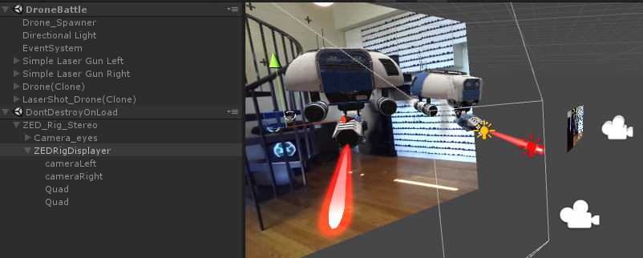

To view this rig at runtime, enable **Show Final AR Rig** in ZEDManager's Advanced Settings. 

## Other Useful Scripts

**ZEDLight.cs** 

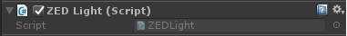

Add this component to any Point, Spot or Directional light to cause it to illuminate the real world. For directional lights, it will also add shadows on the real world if enabled in the light. Note that in Forward rendering (the default and recommended setting) you can only have 8 such lights at a time. In deferred rendering, you do not need to attach the **ZEDLight** component for lights to work, and there is no limit to how many you have. 

Read more [here](https://docs.stereolabs.com/mixed-reality/unity/lighting/). 

**ZEDGreenScreenManager.cs**

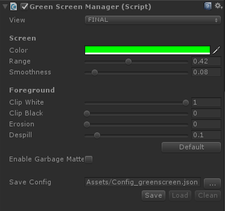

Removes green pixels (or pixels of another specified color) from the real world, to make the background visible regardless of depth. Useful for filming a VR user from third-person. 

**ZEDGreenScreenManager** must be added to the same object as the cameras within the ZED rig. However, a few other changes to the rig are required to make it work, so it's recommended to use the rig prefab in **ZED** -> **Examples** -> **GreenScreen** -> **Prefabs** instead of modifying ZED_Rig_Mono. 

 - **View** lets you see different steps of the rendering stage, which can be helpful for tweaking the other settings. 
 - **Color** defines the color that's subtracted. 
 - **Range** governs how similar a pixel must be to the chosen color to get removed. 
 - **Smoothness** causes pixels on the edge of the range to the color to fade out, instead of all pixels being 100% or 0% visible. 
 - **Clip White** causes pixels with alpha values above its setting to be set to 100% alpha, useful for reducing noise from your smoothness setting. 
 - **Clip Black** is the opposite of Clip White, causing pixels with alphas below its value to be completely invisible. 
 - **Erosion** carves off pixels from the edges between the foreground and background.
 - **Despill** subtracts the color value from the foreground image, making it appear "less green" for instance. Useful because bright lighting can cause the color of a greenscreen to spill onto your actual subject. 
 - **Enable Garbage Matte** opens up a new window that lets you define a border outside which no real pixels are displayed. Useful if your greenscreen isn't big enough to fill the whole screen. 
 - **Save Config** lets you save and load the settings in the inspector, to load in a different project or switch between different studio setups. Note that a relative path (like the default) may work in the Editor but not a build. 

Find more documentation [here](https://docs.stereolabs.com/mixed-reality/unity/green-screen-vr/) and a detailed guide on greenscreen capture with the ZED [here](https://www.stereolabs.com/blog/how-to-make-mixed-reality-vr-videos-in-unity/). Also see the included GreenScreen sample scene. 

**ZEDPlaneDetectionManager**

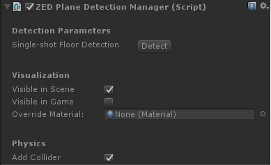

Lets you click on the screen or specify screen-space coordinates to detect a flat surface in the real world. If it finds one, it'll instantly turn the whole visible surface into a plane, complete with physics. 

Unlike Spatial Mapping, Plane Detection works in real-time, so it's often better for placing objects in the real world, or collisions. 

To use, create an empty GameObject and add the **ZEDPlaneDetectionManager** component to it. At runtime, click on the window to check for a plane there. You can also click **Detect** to check for a plane in the scene that represents the floor. 

 - **Visible in Scene** governs whether you see planes in the Scene window.
 - **Visible in Game** governs whether you see planes in the Game view. Disabling can be useful if you just want planes for collisions. 
 - **Override Material** will replace the default wireframe material on created planes with the material you specify. 
 - **Add Collider** causes the manager to add a Mesh Collider to planes once spawned, enabling collisions. 

See the two included Plane Detection samples to explore further. 

**ZEDControllerTracker**

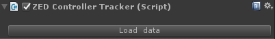

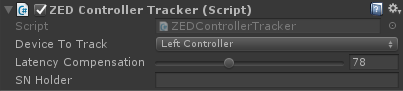

If you have the Oculus Integration or SteamVR Plugin installed, **ZEDControllerTracker** will move the GameObject on which it's attached to the controller, headset or Vive Tracker specified after a small, adjustable delay. This delay is meant to correspond with the ZED image's latency. Adding this component fixes an effect where you see a virtual controller object move ahead of your real hands since the Oculus/Vive tracking systems have less latency than the ZED. 

 - **Load Data** searches for and loads information about the Oculus or SteamVR plugins you've imported. This allows it to be agnostic to the two. 
 - **Device To Track** specifies which tracked object you want it to connect to, without requiring a reference to an actual GameObject. 
 - **Latency Compensation** governs the length of the added latency. 
 - **SN Holder** lets you specify the exact serial number of an object you want to track. This is filled automatically but you can use it to override the detected settings. 

See the laser guns on the DroneBattle sample, or the ZED rig holder object in the GreenScreen sample for examples. 

**ZEDSupportFunctions.cs**

A static class holding many static functions that simplify a number of interactions with the ZED. The functions are diverse and worth exploring in detail. Some notable examples include: 

 - `public static bool GetNormalAtPixel(Vector2 pixel, sl.REFERENCE_FRAME reference_frame, Camera cam, out Vector3 normal)` returns the normal (direction) of the real world given a screen-space point specified. 
 - `public static bool GetForwardDistanceAtWorldLocation(Vector3 position, Camera cam, out float depth)` lets you check the depth of a single 3D point in the real world.  
 - `public static bool HitTestAtPoint(Camera camera, Vector3 point, bool countinvalidascollision, float realworldthickness)` checks if a virtual point is "collding" with a real point. By default this means that the point is behind the real world, but by specifying realworldthickness, you can ignore collisions that are behind the real world by a certain amount. Useful for checking virtual projectiles against the real world. 
 - `public static bool HitTestOnRay(Camera camera, Vector3 startpos, Quaternion rot, float maxdistance, float distbetweendots, out Vector3 collisionpoint)` emulates Unity's raycast feature by calling HitTestOnPoint() along a line at specified intervals. Useful for object placement and fast-moving projectiles.
 - `public static bool SaveImage(RenderTexture rt, string path)` saves the specified RenderTexture to a .png file. Speficy the RenderTexture in ZEDRenderingPlane or on the Frame objects to snap a picture of the real world. 

**ZEDToOpenCVRetriever**

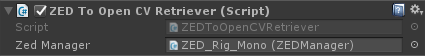

If using the [OpenCV for Unity](https://assetstore.unity.com/packages/tools/integration/opencv-for-unity-21088) package, putting this component in your scene greatly simplifies interfacing the ZED with OpenCV. 

It will automatically create an OpenCV matrix for the ZED's rectified camera parameters, which is required for most spatial OpenCV functions. Then, you can subscribe to a variety of events, named `OnImageUpdated_<imagetype>`, where `<imagetype>` is an image format the ZED can provide, such as `LeftRGBA` or `LeftGrayscale`. Then, whenever a new ZED image arrives, this component will deploy any events with listeners with the ZED's left camera reference, the Camera matrix, and an OpenCV matrix of that image. 

You can see examples of ZEDToOpenCVRetriever being used in the ArUco sample scenes, where **ZEDArUcoDetectionManager** subscribes to them in order to move GameObjects to visible ArUco markers. 

## Additional Resources: 

Want more details? Our [Documentation](https://docs.stereolabs.com/mixed-reality/unity/getting-started/) has overviews and tutorials for getting started with specific features. 

Not sure where to start with attaching your ZED Mini to your VR headset? See our guides for [Oculus Rift](https://www.stereolabs.com/zed-mini/setup/rift/) and [HTC Vive](https://www.stereolabs.com/zed-mini/setup/vive/).

Got a problem you just can't seem to solve? Contact our support at [support@stereolabs.com](mailto:support@stereolabs.com). 

Made something amazing you'd love to share with us? Email our developer evangelist at [chris.orris@stereolabs.com](mailto:chris.orris@stereolabs.com).

