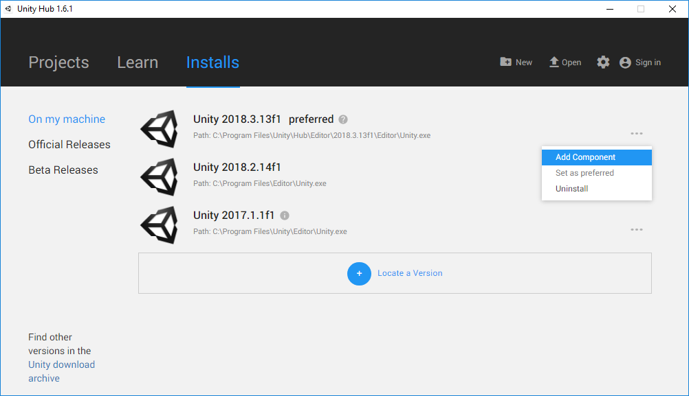
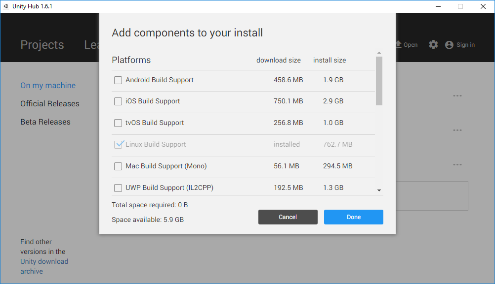
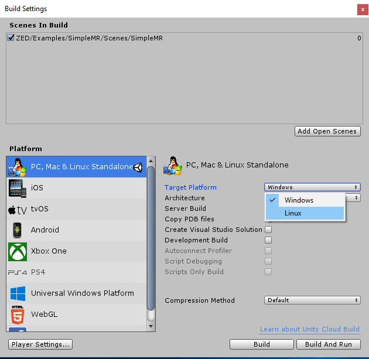
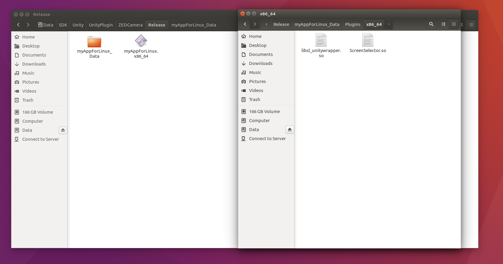

# Unity plugin -- How to build an application for Linux

## Introduction
In this tutorial, we will show how easy it is to build an application for Linux when you are running the Unity editor on Windows.

Note that the current official plugin version does not support Linux. The Linux support is currently in beta.

We won't cover how to create the scenes, as it's the exact same as Windows and covered in our [Unity documentation](https://www.stereolabs.com/docs/unity/). 

## Requirements
* Requires Unity 2018.x. (plugin is now using UnityEngine.XR)
* Unity Editor in OpenGLCore/Desktop graphic API (DirectX does not exist on Linux)
* ZED Unity Plugin from github, on Linux_compatibility_beta branch.

## What's Different about the Linux Native Plugin?

The Unity plugin revolves around the ZED Unity wrapper, sl_unitywrapper.dll, a single library that provides access to ZED SDK functions. Under Windows, you can find this library in SDK/Plugins/Win64/.

Under Linux, it's instead an .so library (similar to a dll for Linux) called libsl_unitywrapper.so in the SDK/Plugins/Linux/ folder.

Under the hood, there are some differences with the Windows version:
- On Windows, the .dll is dynamically linked against the ZED SDK and statically linked against CUDA(rt). Therefore, due to the way Windows resolves the dependencies, the wrapper will load the ZED SDK libraries installed on the PC.
- On Linux, any dependencies of a library must be linked once the executable is created. 
 Since we support multiple CUDA versions and multiple Ubuntu LTS versions (16 and 18), that would mean a different version for each configuration. Since when you are building an application for Linux, you may not know what the final target would be, other than that it's Linux. It was not possible to keep it that way.

To solve this, the ZED SDK is statically embedded in the Linux wrapper library. The big advantage this provides is that you don't need to worry about the CUDA version and even the Ubuntu version (for 16LTS and 18LTS).
Furtermore, unlike Windows, you *don't need to install the ZED SDK* on the target device since it is already inside the wrapper.
 *One library to rule them all...*

## Install the Linux Build Support on Windows

When you install Unity on Windows, it does not come with Linux build support by default. This is what you need to specify that the application will run on Linux.
To install it, go to the Unity Hub on the *Installs* tab :
On the desired Unity version, click on *...* and select Add Component:

This will open a list of components you can add to your installation. Select Linux Build Support:

Wait for the installation to complete and restart Unity Hub.

## Create your Project in Unity

* When Unity is started, create a new project, enter a name and click on "Create Project"
* In the menu bar, click on Assets >> Import Package >> Custom Package... and select the ZED Unity package file (xxxxx.unitypackage). The unity import window should appear and click on "import".
* In the project window, select one of the provided scene located in ZED/Examples/XXXX/Scenes/ by double clicking on it. You can also use the prefabs.
* A simple scene with spheres and cubes should appear in the Scene and Game window.
* Click on play button to launch it.

## Build the Application

On the Unity Menu bar, click on **File** -> then **Build Settings** to build your application (or Ctrl+Shift+B). A familiar popup will open.
Now that you've installed Linux support in Unity, you can choose Linux as the Target Platform in addition to Windows.

* Select Linux and click on Build.

* Under Linux, the application will be called XXXXX.x86_64 with a XXXX_data folder attached. Inside the XXX_data/plugins folder, you will see the libsl_unitywrapper.so directly inside.

* Copy both the file and folder oto your Linux desktop. You may need to set the file as an executable : 
`$ chmod +x ./XXXXX.x86_64`

Launch the application and enjoy it running on Linux.
